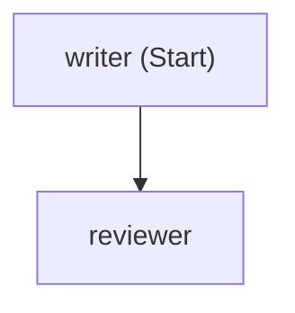
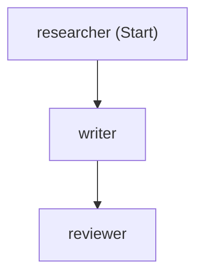

# Agents in Workflow - Getting Started

## Overview

Workflows can be utilized in various scenarios to integrate AI agents effectively. This guide provides an overview of the **Agents in Workflow** examples from the Microsoft Agent Framework, helping you identify the best pattern for your specific needs. For detailed insights, refer to the [Agents-In-Workflow Guide](Agents-In-Workflow-Guide.md).

### Use Cases for Agents in Workflow

1. **Content Creation and Review**: Use workflows to chain a Writer agent with a Reviewer agent for generating and refining content. Ideal for tasks like blog writing, slogan creation, or document editing.

2. **Research and Summarization**: Combine a Researcher agent with a Writer and Reviewer to gather information, create structured content, and ensure quality. Perfect for creating detailed reports or articles.

3. **Multi-Agent Collaboration**: Implement workflows with multiple agents working in sequence or parallel to handle complex tasks. Suitable for scenarios like multi-step data processing or collaborative content creation.

In this section, we will explore the provided code samples to understand how to implement and leverage **AI Agents within Workflows**. These examples showcase the seamless combination of AI agents (e.g., GPT-4) with workflow orchestration, enabling sophisticated multi-agent interactions.

| Sample | Description | Complexity |
|--------|-------------|------------|
| [1.agents-in-workflow.py](1.agents-in-workflow.py) | Writer → Reviewer agent workflow | Intermediate |
| [2.agents-in-workflow-viz.py](2.agents-in-workflow.py) | Enhanced Writer → Reviewer with visualization | Intermediate |
| [3.Researcher-Writer-Reviewer-Workflow.py](3.Researcher-Writer-Reviewer-Workflow.py) | Three-agent workflow with research phase.<br/>Researcher → Writer → Reviewer pipeline for comprehensive content creation. | Advanced |

---

## Prerequisites

### Required Packages
install all dependencies from the root requirements.txt:

```bash
pip install -r ../../../../requirements.txt
```

### Python Version
- Python 3.10 or later

### Azure OpenAI Required ⚠️

#### Environment Variables

⚠️ **Important**: These samples require credential-based authentication. API key authentication has been **disabled** on the Azure OpenAI resources.

Create a `.env` file in the project root with:

```bash
# Working Azure OpenAI Configuration
AZURE_OPENAI_ENDPOINT=https://<Your-Open-AI>.openai.azure.com
AZURE_OPENAI_CHAT_DEPLOYMENT_NAME=<Deployment-Model>
# Note: AZURE_OPENAI_API_KEY is NOT used (authentication disabled)
```

#### Azure CLI Authentication

```bash
# Login to Azure (required for AzureCliCredential)
az login

# Verify authentication
az account show
```

---

## Sample Outputs & Results

### 🚀 Sample 1: Simple Two-Agent Workflow
**File:** [1.agents-in-workflow.py](1.agents-in-workflow.py)

#### Execution Output:
```
writer: "Electrify Your Journey: Affordable, Thrilling, Unstoppable!"
reviewer: Consider simplifying the slogan for direct impact. For example: "Affordable Power, Pure Joy." This highlights affordability and fun in a concise, catchy manner.
============================================================
Workflow Outputs: []
Final state: WorkflowRunState.IDLE
```

---

### 🎨 Sample 2: Enhanced Workflow with Visualization  
**File:** [2.agents-in-workflow.py](2.agents-in-workflow.py)

#### Mermaid Workflow Diagram:


#### Execution Output:
```
🔍 AZURE_OPENAI_ENDPOINT: https://rks-rag-openai.openai.azure.com
🔍 AZURE_OPENAI_CHAT_DEPLOYMENT_NAME: gpt-4o
🔍 AZURE_OPENAI_API_KEY present: False
============================================================
🔐 Creating AzureOpenAIChatClient with AzureCliCredential...
============================================================
📊 WORKFLOW VISUALIZATION
============================================================

📌 Mermaid Diagram (copy/paste to https://mermaid.live):
--------------------------------------------------
flowchart TD
  writer["writer (Start)"];
  reviewer["reviewer"];
  writer --> reviewer;
--------------------------------------------------

📄 Exporting workflow diagrams...
   ✅ SVG saved: agents_workflow.svg
   ✅ PNG saved: agents_workflow.png

writer: "Power Up Your Adventure: Affordability Meets Electrifying Fun!"
reviewer: Consider simplifying the slogan to make it more memorable. For example: "Affordable Power, Electrifying Fun!" This captures the essence without being overly wordy.
============================================================
Workflow Outputs: []
Final state: WorkflowRunState.IDLE
```

---

### 📚 Sample 3: Three-Agent Research Workflow
**File:** [3.agents-in-workflow.py](3.agents-in-workflow.py)

#### Mermaid Workflow Diagram:


#### Execution Summary:
```
============================================================
🚀 RUNNING WORKFLOW
============================================================

==================== RESEARCHER ====================
# The Benefits of AI Agents in Enterprise: Unlocking New Levels of Efficiency

[Comprehensive research content with 7 key benefits, examples from UiPath, IBM Watson, Salesforce, etc., including sources and citations]

==================== WRITER ====================
# The Benefits of AI Agents in Enterprise: Unlocking New Levels of Efficiency

[Engaging, well-structured blog post with clear sections, real-world examples, and reader-friendly formatting]

==================== REVIEWER ====================
[Final polished version with improved transitions, professional tone, and comprehensive structure covering:
- Streamlined Operations for Improved Productivity
- Enhancing Customer Experience at Scale  
- Reducing Operational Costs
- Data-Driven Decision Making
- Seamless Integration Across Departments
- Elevated Security and Risk Management
- Empowering Employees, Not Replacing Them]

============================================================
📝 WORKFLOW SUMMARY
============================================================
Total agents executed: 3
Workflow outputs: []

============================================================
🏆 FINAL RESULT (from Reviewer)
============================================================
[Complete publication-ready blog post of ~2000 words with professional formatting, actionable insights, and compelling conclusion]

============================================================
✅ Final state: WorkflowRunState.IDLE
============================================================
```

---

### What is an Agent in a Workflow?

An **Agent** is an AI-powered executor that can:
- Have system instructions (personality/role)
- Process natural language input
- Generate intelligent responses using LLMs

When placed in a workflow, agents can be **chained together** to create multi-agent systems.

### Sequential vs Agents-in-Workflow

```
SEQUENTIAL WORKFLOW (rule-based):
[Input] → [Transform A] → [Transform B] → [Output]
            (code logic)    (code logic)

AGENTS-IN-WORKFLOW (AI-powered):
[User Prompt] → [Writer Agent] → [Reviewer Agent] → [Final Output]
                  (GPT-4)           (GPT-4)
```

### Agent Workflow Pattern

```
┌────────────────────────────────────────────────────────────────────┐
│                    WRITER → REVIEWER PATTERN                       │
├────────────────────────────────────────────────────────────────────┤
│                                                                    │
│   [User Prompt]                                                    │
│   "Create a slogan for a new electric SUV..."                      │
│        │                                                           │
│        ▼                                                           │
│   ┌──────────────────────────────────────────┐                     │
│   │           🤖 WRITER AGENT                │                     │
│   │   Instructions: "You are an excellent    │                     │
│   │   content writer..."                     │                     │
│   │                                          │                     │
│   │   Output: "Charge Up Your Adventure—     │                     │
│   │   Affordable Fun, Electrified!"          │                     │
│   └────────────────┬─────────────────────────┘                     │
│                    │                                               │
│                    ▼                                               │
│   ┌──────────────────────────────────────────┐                     │
│   │          🔍 REVIEWER AGENT               │                     │
│   │   Instructions: "You are an excellent    │                     │
│   │   content reviewer. Provide actionable   │                     │
│   │   feedback..."                           │                     │
│   │                                          │                     │
│   │   Output: Refined slogan + feedback      │                     │
│   └────────────────┬─────────────────────────┘                     │
│                    │                                               │
│                    ▼                                               │
│   [Final Reviewed Output]                                          │
│                                                                    │
└────────────────────────────────────────────────────────────────────┘
```

### Key Components

| Component | Description |
|-----------|-------------|
| **AzureOpenAIChatClient** | Client to connect to Azure OpenAI |
| **as_agent()** | Converts a chat client into a workflow-compatible agent |
| **instructions** | System prompt defining the agent's role |
| **AgentRunEvent** | Event emitted when an agent produces output |
| **AzureCliCredential** | Uses `az login` for authentication |

---


## Next Steps

- Add more agents to create complex multi-agent workflows
- Combine with concurrent patterns for parallel agent execution
- Add branching logic for conditional agent routing
- [4. DevUI Workflow](../4.DevUI-Workflow/Readme.md) - Explore interactive DevUI for developing and debugging workflows.

---

## Resources

- [Microsoft Agent Framework - Agents in Workflows](https://learn.microsoft.com/en-us/agent-framework/tutorials/workflows/agents-in-workflows?pivots=programming-language-python)
- [GitHub Sample](https://github.com/microsoft/agent-framework/blob/main/python/samples/getting_started/workflows/_start-here/step2_agents_in_a_workflow.py)
- [Azure OpenAI Documentation](https://learn.microsoft.com/en-us/azure/ai-services/openai/)

---

**Built with ❤️ using Microsoft Agent Framework**
